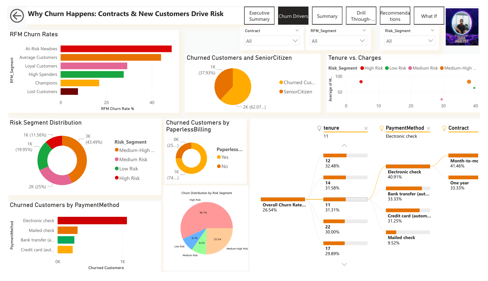
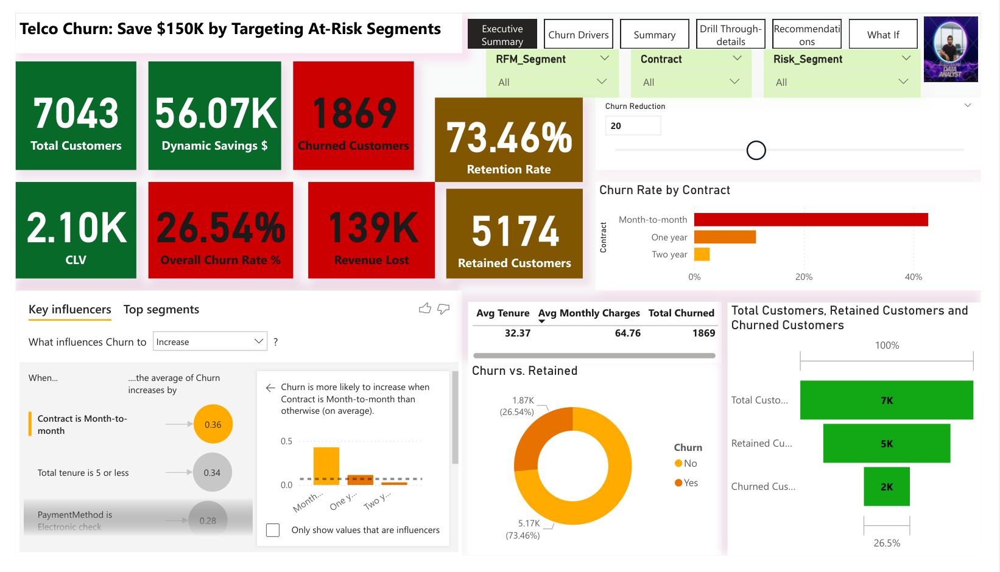
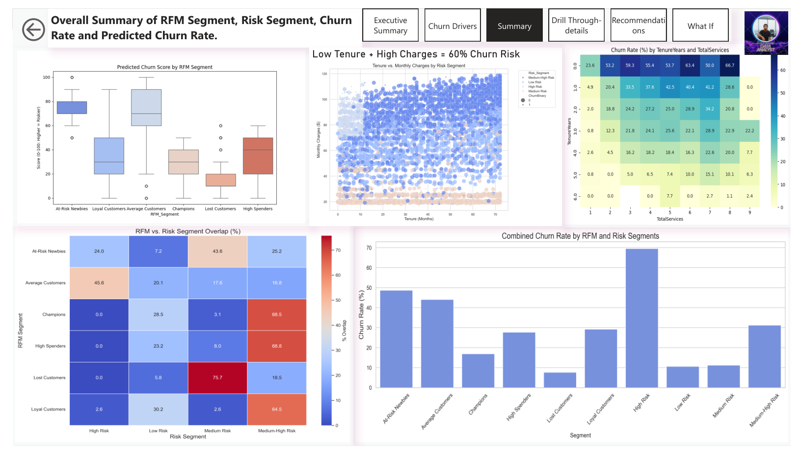
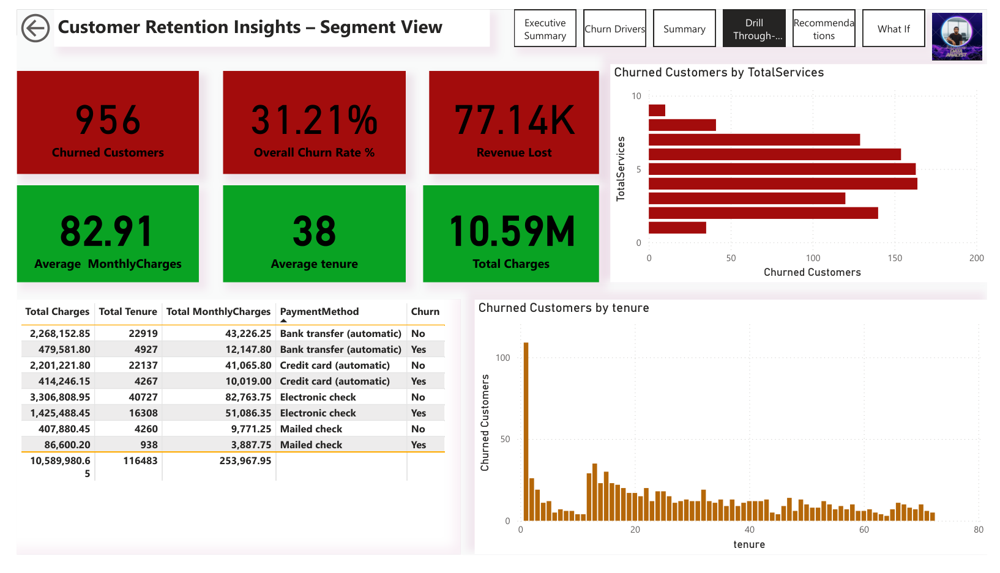
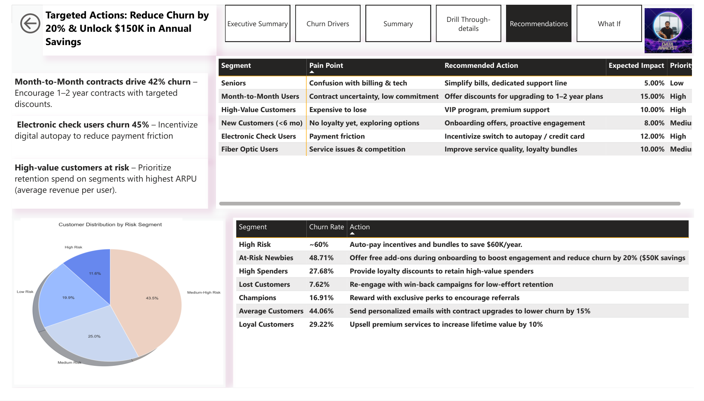
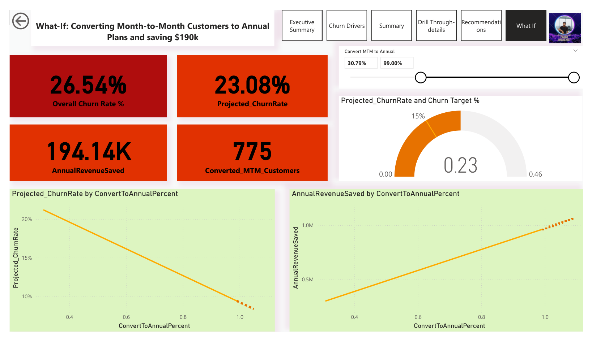

# Telco Customer Churn Analysis: Predictive Insights for Retention Strategies
 


# Project Overview
This project analyzes customer churn in a telecommunications dataset (Kaggle's Telco Customer Churn) to uncover actionable insights for reducing churn and unlocking revenue savings. Using **Python** for data cleaning, exploratory data analysis (EDA), RFM (Recency-Frequency-Monetary) segmentation, and risk profiling, combined with a dynamic **Power BI dashboard**, we identify at-risk segments and recommend strategies to save **$150K annually** by targeting high-risk customers.
Key highlights:

* **Churn Rate:** 26.54% overall, driven by factors like month-to-month contracts (42% churn) and electronic check payments (45% churn).
* **Business Impact:** Dynamic what-if scenarios simulate a 20% churn reduction, projecting $56K in immediate savings.
* **Segmentation:** RFM and rule-based risk segments (e.g., "At-Risk Newbies" at 49% churn) guide personalized retention actions.
* **Tools & Skills Demonstrated:** **Python (Pandas, NumPy, Seaborn, Matplotlib)**, **SQL** (via SQLite for aggregation), **Power BI** (DAX, AI visuals, drill-throughs), Machine Learning basics (predictive scoring proxies).

This portfolio project showcases end-to-end data analytics: from raw data to interactive visualizations and ROI-driven recommendations. 

# Dashboard Screenshots
## Executive Summary Page

*Overview of key metrics: Total Customers (7K), Churned (1.87K), Retention Rate (73.46%), and Dynamic Savings.*


*Deep dive into influencers: RFM churn rates, risk distribution, tenure vs. charges scatter (low tenure + high charges = 60% risk).*


*Heatmaps showing RFM vs. Risk overlaps, predicted churn scores, and combined churn rates.*


*Drill through details*


*Targeted actions: E.g., auto-pay incentives for high-risk segments to save $60K/year.*


*Interactive scenario: Simulate churn reduction by contract conversions, projecting up to $190K savings.*

# Key Insights & Business Recommendations

* **High-Risk Drivers:** Month-to-month contracts and electronic checks account for 42-45% churn. New customers (<6 months) churn at 53%.
* **Segmentation Results:**

* * **Champions (High RFM):** Low churn (17%), focus on upsells.
* * **At-Risk Newbies (Low Recency):** 49% churn, prioritize onboarding perks.
* * **High Risk Segment:** 60% churn, target with bundles and auto-pay.


* **ROI Projection:** 20% churn reduction via targeted actions unlocks $150K in annual savings, based on CLV ($2.1K avg.).
* **Recommendations Table** (from Power BI):

| Segment                | Pain Point                       | Recommended Action                               | Expected Impact | Priority |
|------------------------|----------------------------------|--------------------------------------------------|----------------|----------|
| Seniors                | Confusion with billing & tech    | Simplify bills, dedicated support line            | 5.00%          | Low      |
| Month-to-Month Users   | Contract uncertainty, low commitment | Offer discounts for upgrading to 1–2 year plans | 15.00%         | High     |
| High-Value Customers   | Expensive to lose                | VIP program, premium support                      | 10.00%         | High     |
| New Customers (<6 mo)  | No loyalty yet, exploring options | Onboarding offers, proactive engagement           | 8.00%          | Medium   |
| Electronic Check Users | Payment friction                 | Incentivize switch to autopay / credit card       | 12.00%         | High     |
| Fiber Optic Users      | Service issues & competition     | Improve service quality, loyalty bundles          | 10.00%         | Medium   |


# Business Questions Addressed by This Project
This project answers critical, sought-after questions that drive telecom business decisions, based on industry best practices. These questions focus on retention, cost savings, and growth:

* **What is the overall churn rate, and how does it impact revenue?** (E.g., 26.54% churn leads to $139K lost; reducing by 20% saves $56K.)

* **Which customer segments (demographics, services, contracts) have the highest churn risk?** (E.g., Seniors: 37% churn; Fiber optic users: Higher risk due to service issues.)

* **What are the key drivers and predictors of churn?** (E.g., Month-to-month contracts, electronic checks, low tenure, high charges.)

* **How can we predict which customers are likely to churn in the next period?** (RFM/risk segments below for probabilistic scoring)

* **What retention strategies can reduce churn, and what's their projected ROI?** (E.g., Contract upgrades for month-to-month users: 15% impact; Auto-pay incentives: 12% reduction.)

* **How does churn vary by service usage, payment methods, and external factors?** (E.g., Paperless billing correlates with higher churn; Industry benchmarks show telco churn at 20-25%.)

* **What is the cost of acquiring new customers vs. retaining existing ones?** (Attracting new costs 5x more; Focus on high-CLV segments like Champions.)

* **How effective are current retention policies, and what improvements are needed?** (E.g., Prioritize VIP programs for high-value customers; Onboarding for newbies.)

These questions align with real-world telecom challenges, helping businesses like yours optimize retention and boost profitability.

# Technologies Used

* **Python:** Data cleaning, aggregation, EDA, RFM segmentation (Pandas, NumPy, Seaborn, Matplotlib).

* **Power BI:** Interactive dashboard with DAX measures, AI visuals (key influencers, decomposition trees), what-if parameters.

* **SQL:** Data aggregation via SQLite in Python notebooks.

* **Dataset:** Telco Customer Churn (7K rows, 21 features) – cleaned and segmented versions included.
# Installation & Setup
* **1. Clone the repo:**
[Telco Churn Analysis](https://github.com/rakibakond95/Telco_customer_churn_analysis.git)

* **2. Install Python dependencies**

``` pip install -r requirements.txt  # Includes pandas, numpy, seaborn, matplotlib, sqlite3 ```

* **3. Download the Power BI file** [Telco Churn Dashboard](data/Telco_powerbi_dashboard.pbix) from the repo and open in Power BI Desktop.

**DashBoard PDF:** Download this Dashboard
* [Telco churn analysis dashboard](data/Telco_powerbi_dashboard.pdf)

* **4. Run notebooks in Jupyter**
  ``` jupyter notebook```
  * [clean&aggregate_data.ipynb](Analyze_data/clean&aggregate_data.ipynb):Data loading and SQL aggregation.
  * [EDA.ipynb](Analyze_data/EDA.ipynb):Visualizations and insights.
  * [Customer_segmentation&behavior_analysis.ipynb](Analyze_data/Customer_segmentation&behavior_analysis.ipynb):RFM and risk segmentation.

 # Usage

* **Run Analysis:** Execute the notebooks sequentially to generate cleaned CSVs and visuals.

* **Interact with Dashboard:** Open .pbix file; use slicers for RFM/Risk/Contract filtering and what-if slider for simulations.

* **Customize:** Adapt the code for your dataset – e.g., replace [Telco Customer Churn.csv](data\telco_customer_churn_copy.csv) with your own

# Project Structure
``` 
telco-churn-analysis/
├── data/                  # Raw and cleaned datasets (CSV)
├── notebooks/             # Jupyter notebooks for cleaning, EDA, segmentation
├── assets/                # Dashboard screenshots and generated plots
├── Telco_Churn_Dashboard.pbix  # Power BI file
├── requirements.txt       # Python dependencies
└── README.md              # This file
```


# Contributing
Fork the repo and submit a pull request with improvements (e.g., ML churn prediction integration). Open issues for bugs or feature requests.

## License
This project is licensed under the MIT License - see the [LICENSE](LICENSE) file for details.

# Contact & Hire Me

* **LinkedIn:** [Rakib Akond](https://www.linkedin.com/in/rakibakond) – Let's connect for data analytics opportunities!

* **Email:** rakibakond95@gmail.com

# Python Code Snippets Example

## 1. Data Cleaning & Aggregation (from [clean&aggregate_data.ipynb](Analyze_data/clean&aggregate_data.ipynb))
This snippet shows Pandas data loading, options setting, and basic aggregation – highlights efficiency in handling datasets.

```python
# Importing essential libraries
import pandas as pd
import numpy as np
import seaborn as sns
import matplotlib.pyplot as plt
import sqlite3
from sqlalchemy import create_engine

# Set display options for better readability
pd.set_option("display.max_column", None)
pd.set_option("display.max_rows", None)
pd.set_option("display.float_format", lambda x: "%.3f" % x)

# Load dataset
telco = pd.read_csv('../data/telco_customer_churn.csv')

# Example aggregation: Churn rate by contract type
contract_churn = telco.groupby('Contract')['Churn'].agg(
    TotalCustomers='count',
    ChurnedCustomers=lambda x: (x == 'Yes').sum(),
    ChurnRate=lambda x: (x == 'Yes').mean() * 100
).reset_index()

# Save to CSV for Power BI import
contract_churn.to_csv('../data/contract_churn.csv', index=False)
print(contract_churn.head())
```
# 2. EDA Visualization (from [EDA.ipynb](Analyze_data/EDA.ipynb))
This shows Seaborn plotting for insights – great for visual storytelling.

```python
import seaborn as sns
import matplotlib.pyplot as plt

# Load aggregated data
contract_churn = pd.read_csv('../data/contract_churn.csv')

# Bar plot for churn by contract
plt.figure(figsize=(8, 5))
sns.barplot(x='Contract', y='ChurnRate', data=contract_churn)  # Note: Use ChurnRatePercent if renamed
plt.title('Churn Rate by Contract Type')
plt.ylabel('Churn Rate (%)')
plt.xlabel('Contract Type')
plt.show()
```
# 3. RFM Segmentation (from [Customer_segmentation&behavior_analysis.ipynb](Analyze_data\Customer_segmentation&behavior_analysis.ipynb))
This core snippet demonstrates custom RFM scoring tailored to churn – showcases analytical thinking.

```python
# RFM Calculation
telco['R_Score'] = pd.qcut(telco['Recency'], 5, labels=[1, 2, 3, 4, 5])  # Lower recency = higher risk (1=high churn)
telco['F_Score'] = pd.qcut(telco['Frequency'].rank(method='first'), 5, labels=[1, 2, 3, 4, 5])
telco['M_Score'] = pd.qcut(telco['Monetary'], 5, labels=[1, 2, 3, 4, 5])

telco['RFM_Score'] = telco['R_Score'].astype(str) + telco['F_Score'].astype(str) + telco['M_Score'].astype(str)

# Segment mapping (example)
segment_map = {
    r'[4-5][4-5][4-5]': 'Champions',
    r'[1-2][1-2][1-2]': 'At-Risk Newbies',
    # Add more mappings...
}
telco['RFM_Segment'] = telco['RFM_Score'].replace(segment_map, regex=True)

# Churn by segment
rfm_churn = telco.groupby('RFM_Segment')['ChurnBinary'].mean() * 100
print(rfm_churn)
```
# 4. Risk Segmentation (from [Customer_segmentation&behavior_analysis.ipynb](Analyze_data\Customer_segmentation&behavior_analysis.ipynb))
```python
# Rule-based Risk Segmentation
def assign_risk(row):
    if row['tenure'] <= 6 and row['MonthlyCharges'] > 80:  # High risk example
        return 'High Risk'
    # Add more conditions...
    return 'Low Risk'

telco['Risk_Segment'] = telco.apply(assign_risk, axis=1)

# Visualize churn by risk
sns.barplot(x='Risk_Segment', y='ChurnBinary', data=telco)
plt.title('Churn Rate by Risk Segment')
plt.show()
```

# SQL Highlights
Data aggregation on SQL via SQLite on Jupyter Notebook
[clean&aggregate_data.ipynb](Analyze_data/clean&aggregate_data.ipynb)
### Setup: Load Data into SQLite

```sql
import pandas as pd
import sqlite3

# Load data (replace with your path; using cleaned CSV from notebook)
telco = pd.read_csv('../data/telco_churn_cleaned_updated.csv')

# Create SQLite connection and load data
conn = sqlite3.connect(':memory:')  # In-memory for testing
telco.to_sql('telco', conn, index=False)
```
### 1. Churn Rate by Contract Type
This query calculates total customers, churned count, and churn rate per contract—mirroring the Pandas groupby for dashboard visuals.

```sql
--  Data is in a 'telco' table after loading via SQLAlchemy
SELECT 
    Contract,
    COUNT(*) AS TotalCustomers,
    SUM(CASE WHEN Churn = 'Yes' THEN 1 ELSE 0 END) AS ChurnedCustomers,
    ROUND(100.0 * SUM(CASE WHEN Churn = 'Yes' THEN 1 ELSE 0 END) / COUNT(*), 2) AS ChurnRatePercent
FROM telco
GROUP BY Contract
ORDER BY ChurnRatePercent DESC;
```
| Contract       | Total Customers | Churned Customers | Churn Rate (%) |
| -------------- | --------------- | ----------------- | -------------- |
| Month-to-month | 3,875           | 1,655             | 42.71          |
| One year       | 1,473           | 166               | 11.27          |
| Two year       | 1,695           | 48                | 2.83           |

### 2. Churn Rate by Payment Method
Aggregates churn by payment type, useful for identifying high-risk methods like electronic check (45% churn).
```sql
SELECT 
    PaymentMethod,
    COUNT(*) AS TotalCustomers,
    SUM(CASE WHEN Churn = 'Yes' THEN 1 ELSE 0 END) AS ChurnedCustomers,
    ROUND(100.0 * SUM(CASE WHEN Churn = 'Yes' THEN 1 ELSE 0 END) / COUNT(*), 2) AS ChurnRatePercent
FROM telco
GROUP BY PaymentMethod
ORDER BY ChurnRatePercent DESC;
```
| Payment Method            | Total Customers | Churned Customers | Churn Rate (%) |
| ------------------------- | --------------- | ----------------- | -------------- |
| Electronic check          | 2,365           | 1,071             | 45.29          |
| Mailed check              | 1,612           | 308               | 19.11          |
| Bank transfer (automatic) | 1,544           | 258               | 16.71          |
| Credit card (automatic)   | 1,522           | 232               | 15.24          |
### 3. RFM Segmentation Setup (Prep for Analysis)
This creates a view for RFM scores, joining with churn for risk analysis—prepares data for Power BI import.
```sql
CREATE VIEW rfm_view AS
SELECT 
    customerID,
    tenure AS Recency,
    (CASE WHEN PhoneService = 'Yes' THEN 1 ELSE 0 END + 
     CASE WHEN MultipleLines = 'Yes' THEN 1 ELSE 0 END + 
     -- Add other services...
    ) AS Frequency,  -- Proxy for TotalServices
    TotalCharges AS Monetary,
    Churn
FROM telco;

-- Then query churn by RFM bins (simplified)
SELECT 
    CASE 
        WHEN Recency <= 6 THEN 'Low Recency (High Risk)'
        ELSE 'High Recency (Low Risk)'
    END AS RecencyBin,
    ROUND(100.0 * SUM(CASE WHEN Churn = 'Yes' THEN 1 ELSE 0 END) / COUNT(*), 2) AS ChurnRatePercent
FROM rfm_view
GROUP BY RecencyBin;
```


# Power BI DAX used in this project

```DAX
1. Total Customers = COUNTROWS('telco_churn_cleaned')

2. Revenue Lost = CALCULATE(SUM(telco_churn_cleaned[MonthlyCharges]), telco_churn_cleaned[ChurnBinary] = 1)

3. Retention Rate = [Retained Customers]/[Total Customers]

4. Retained Customers = [Total Customers]-[Churned Customers]

5. Churned Customers = CALCULATE([Total Customers], 'telco_churn_cleaned'[ChurnBinary] = 1)

6. Avg Tenure = AVERAGE('telco_churn_cleaned'[tenure])
7. Avg Monthly Charges = AVERAGE('telco_churn_cleaned'[MonthlyCharges])

8. At-Risk Newbies Savings $ = CALCULATE([Churned Customers], 'rfm_churn'[RFM_Segment] = "At-Risk Newbies") * 150 * 0.2

9. At-Risk Newbies Impact $ = CALCULATE([Churned Customers], 'rfm_churn'[RFM_Segment] = "At-Risk Newbies") * 150 * 0.2

10. Risk Churn Rate % = DIVIDE(SUM('risk_churn'[Churned]), SUM('risk_churn'[Total]), 0) * 100

11. Retention Savings $ = [Churned Customers] * 150 * 0.2

12. RFM Churn Rate % = DIVIDE(SUM('rfm_churn'[Churned]), SUM('rfm_churn'[Total]), 0) * 100

13. Contract Churn Rate % = DIVIDE(SUM('contract_churn'[Churned]),([Total Customers]) )

```
# DAX for What-if analysis
```DAX
1. -- Month-to-Month group
MTM_Customers =
CALCULATE(
    COUNTROWS( telco_churn_cleaned ),
    telco_churn_cleaned[Contract] = "Month-to-month"
)

2. MTM_ChurnCount =
CALCULATE(
    COUNTROWS( telco_churn_cleaned ),
    telco_churn_cleaned[Contract] = "Month-to-month" &&
    (telco_churn_cleaned[ChurnBinary] = 1)
)

3. MTM_ChurnRate =
DIVIDE( [MTM_ChurnCount], [MTM_Customers], 0 )

4. -- One-year contract group
OneYear_Customers =
CALCULATE(
    COUNTROWS( telco_churn_cleaned ),
    telco_churn_cleaned[Contract] = "One year"
)

5. OneYear_ChurnCount =
CALCULATE(
    COUNTROWS( telco_churn_cleaned ),
    telco_churn_cleaned[Contract] = "One year" &&
    (telco_churn_cleaned[ChurnBinary] = 1)
)

6. OneYear_ChurnRate =
DIVIDE( [OneYear_ChurnCount], [OneYear_Customers], 0 )

-----Simulation DAX

7. Converted_MTM_Customers =
ROUND( [MTM_Customers] * [ConvertToAnnualPercent Value], 0 )

8. Projected_MTM_Churners =
VAR p = [ConvertToAnnualPercent Value]
VAR mtmCust = [MTM_Customers]
VAR mtmRate = [MTM_ChurnRate]
VAR oneyrRate = [OneYear_ChurnRate]
RETURN
    mtmCust * ( (1 - p) * mtmRate + p * oneyrRate )

9. Projected_Total_Churners =
VAR currentAll = [ChurnCount]
VAR mtmBefore = [MTM_ChurnCount]
VAR mtmAfter = [Projected_MTM_Churners]
RETURN
    currentAll - mtmBefore + mtmAfter

10. Projected_ChurnRate =
DIVIDE( [Projected_Total_Churners], [TotalCustomers], 0 )

11. AvgMonthly_MTM =
CALCULATE(
    AVERAGE( telco_churn_cleaned[MonthlyCharges] ),
    telco_churn_cleaned[Contract] = "Month-to-month"
)

12. MonthlyRevenueSaved =
VAR saved_customers = [MTM_ChurnCount] - [Projected_MTM_Churners]
RETURN
    IF( saved_customers > 0, saved_customers * [AvgMonthly_MTM], 0 )

13. AnnualRevenueSaved = [MonthlyRevenueSaved] * 12


```